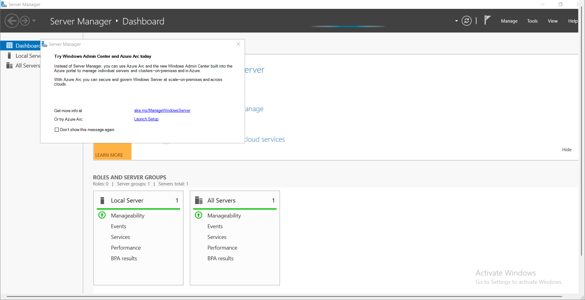
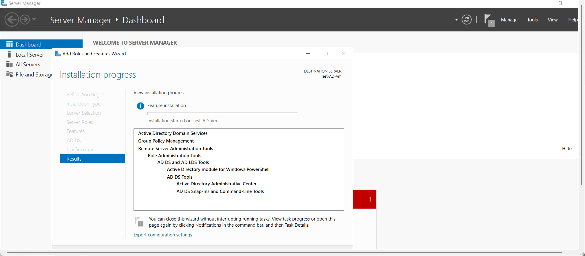
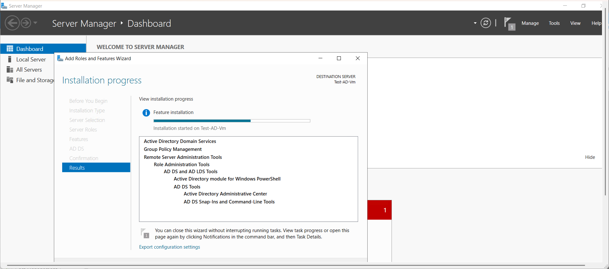
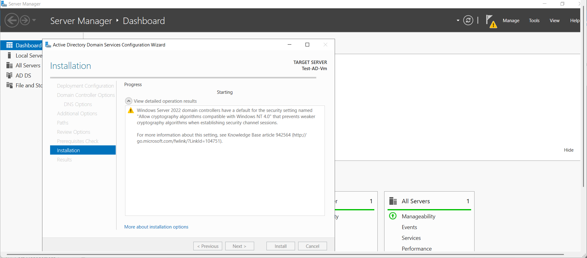
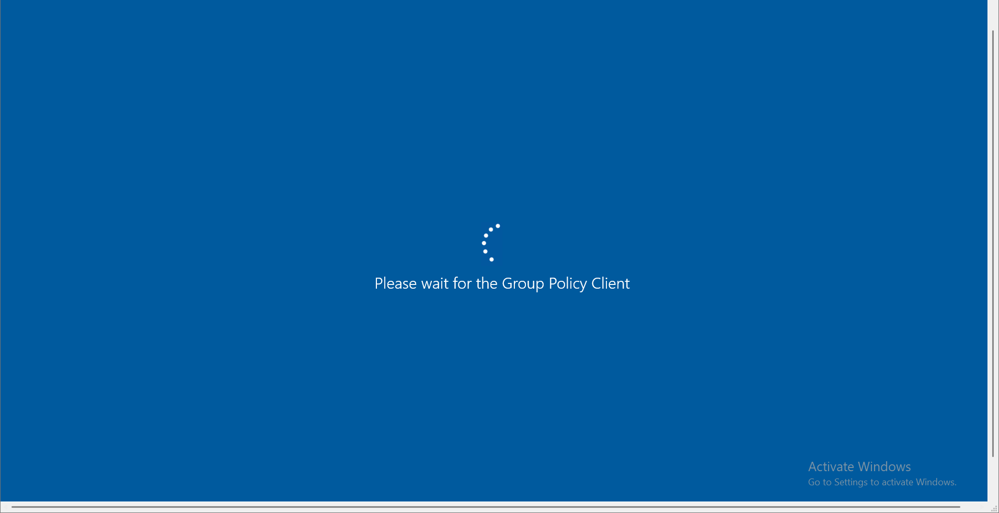
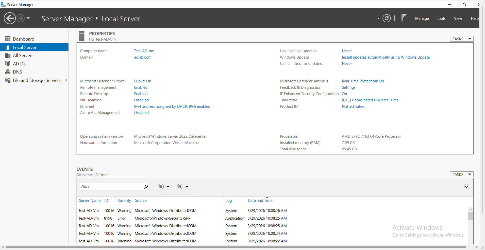
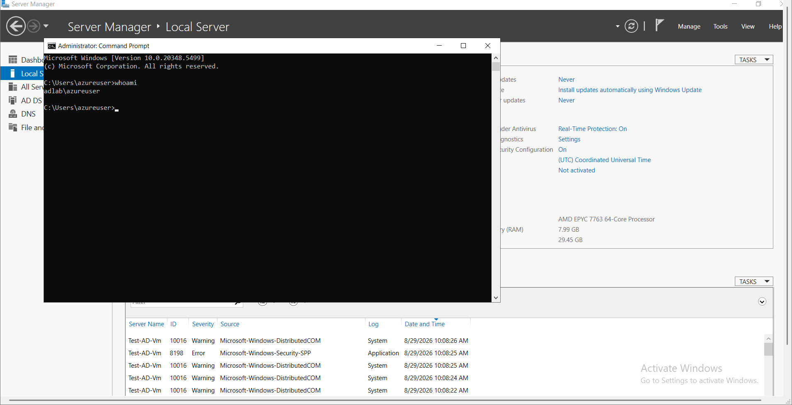

# Project 2: Building an Active Directory Domain Controller in Azure

## 📖 Project Overview
Following the deployment of the foundational Hub and Spoke network, the next critical step in an enterprise environment is centralizing identity and access management. In this project, I provisioned a Windows Server 2022 Virtual Machine in Azure and configured it as an Active Directory Domain Controller. This server will act as the primary identity provider for the lab environment.

## 🛠️ Skills & Technologies Demonstrated
* Windows Server Administration
* Active Directory Domain Services (AD DS)
* DNS Server Configuration
* Identity & Access Management (IAM)

## 🚀 Step-by-Step Implementation

### Step 1: Initial Server Access
I connected to the newly provisioned Windows Server VM to begin the configuration via the Server Manager dashboard.

### Step 2: Installing the AD DS Role
Using the "Add Roles and Features Wizard," I selected the **Active Directory Domain Services** role, which includes the necessary binaries to run a domain.

### Step 3: Feature Installation
I monitored the installation progress to ensure all required Remote Server Administration Tools (RSAT) and AD DS tools were successfully deployed to the virtual machine.

### Step 4: Promoting to a Domain Controller
Once the role installation completed, I ran the configuration wizard to promote the server to a Domain Controller, establishing a brand new root forest and domain named `adlab.com`.

### Step 5: Applying Group Policy
The server required a reboot to finalize the promotion. During the reboot, the system applied the initial Domain Controller Group Policies.

### Step 6: Domain Verification
After logging back in, I verified the local server properties in Server Manager. The server is now officially recognized as part of the `adlab.com` domain.

### Step 7: Identity Confirmation
To definitively prove the domain was functioning and I was authenticated through Active Directory, I used the command prompt to run `whoami`. The output `adlab\azureuser` confirmed I was successfully logged in with domain credentials.

## 💡 Key Takeaways
This project demonstrated the ability to deploy and configure core Windows Server identity infrastructure within a cloud environment. By establishing the `adlab.com` domain, I laid the groundwork for centralized authentication, group policy management, and secure resource access for all future workloads added to the Azure network.
