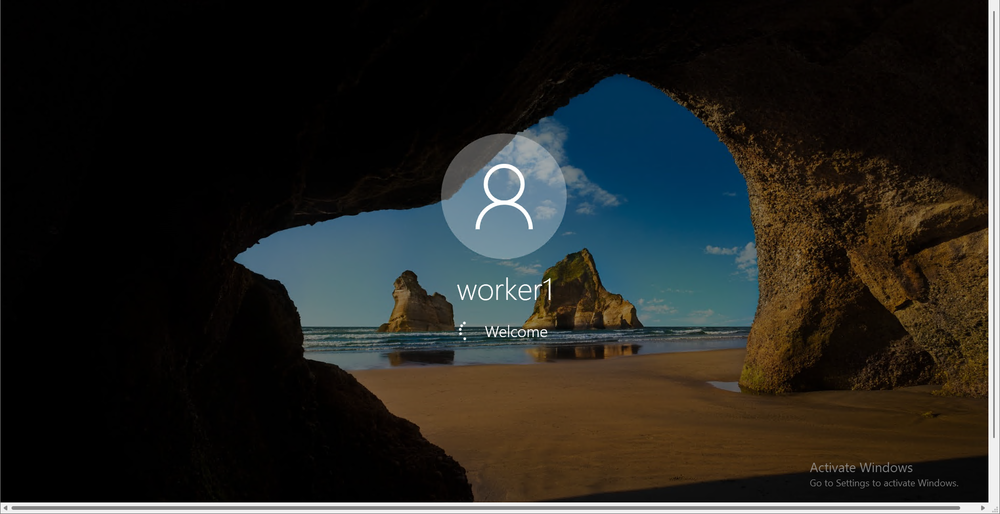
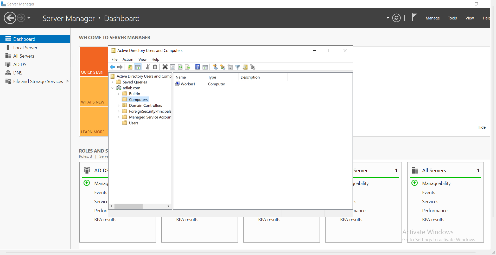
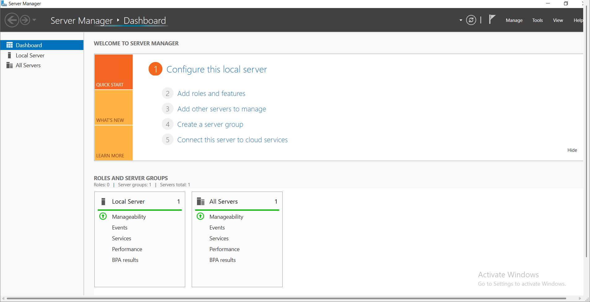
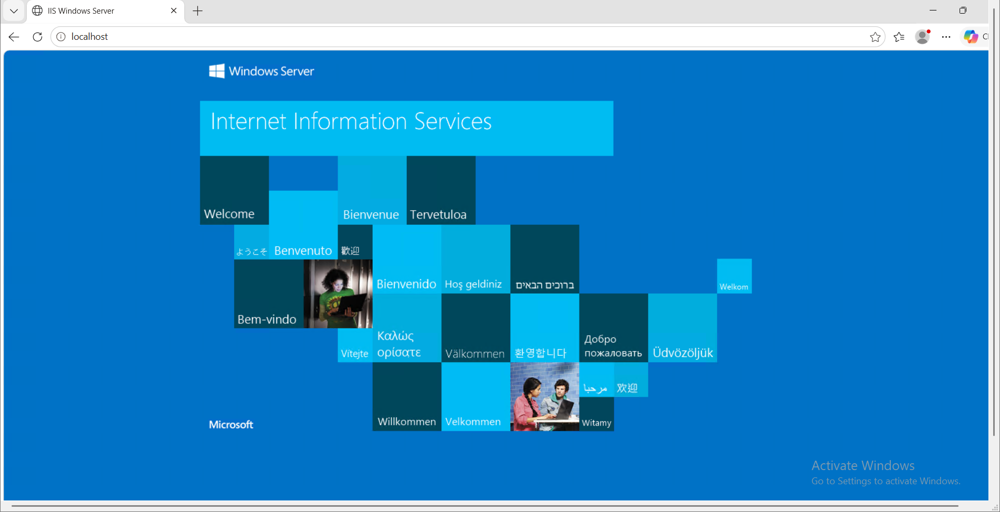
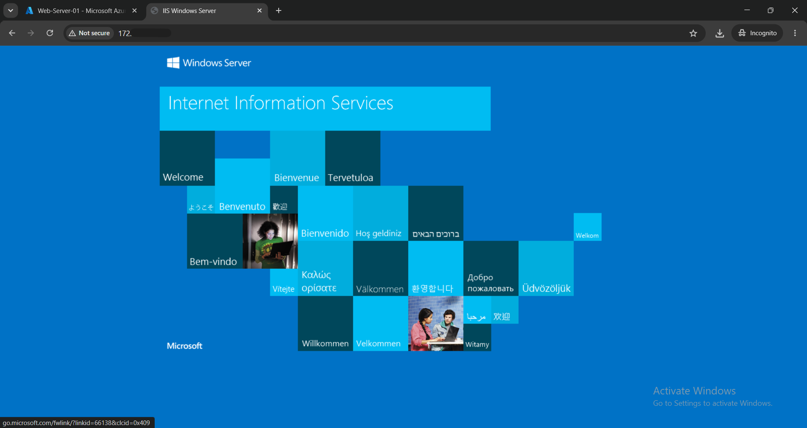

# Project 3: Integrating Workstations and Member Servers into Active Directory

## 📖 Project Overview
Once an Active Directory Domain Controller is established, both client endpoints and enterprise application servers must be integrated into the domain boundary. In this project, I joined a client virtual machine (`Worker1`) to the `adlab.com` domain and verified centralized management. Subsequently, I provisioned a secondary member server, joined it to the domain, and deployed an IIS Web Server to host internal network resources.

## 🛠️ Skills & Technologies Demonstrated
* Active Directory Users and Computers (ADUC)
* Domain Join Configuration & Client Authentication
* Internet Information Services (IIS) Deployment
* Windows Server 2022 Management
* Network Application Testing

## 🚀 Step-by-Step Implementation

### Phase 1: Client Workstation Integration

#### Step 1: Workstation Authentication
After binding the client machine to the `adlab.com` domain, I initiated a sign-in session on the `Worker1` endpoint to confirm credentials and initialize the domain profile.

#### Step 2: Domain Directory Verification
From the Domain Controller's Server Manager, I opened **Active Directory Users and Computers (ADUC)**. Navigating to the `adlab.com` > `Computers` container, I verified that `Worker1` was registered as a recognized domain member object.

### Phase 2: Enterprise Web Server (IIS) Deployment

#### Step 3: Member Server Initialization
I provisioned a new Windows Server VM, joined it to the `adlab.com` domain, and accessed the Server Manager dashboard to begin the Web Server (IIS) role installation.

#### Step 4: Local IIS Verification
After installing the IIS role, I opened a web browser directly on the server and navigated to `localhost`. The default IIS welcome page confirmed the web service was successfully running locally.

#### Step 5: Network Access Verification
To prove the web server was successfully serving traffic to the rest of the internal network, I accessed the server's private IP address from a different machine. The successful page load confirmed proper network routing and firewall configuration.

## 💡 Key Takeaways
Successfully integrating both client endpoints and application servers into Active Directory establishes the baseline for centralized policy management, role-based access control (RBAC), and single sign-on (SSO). Deploying the IIS server on a domain-joined machine ensures that future web applications can securely leverage Active Directory for internal authentication.
