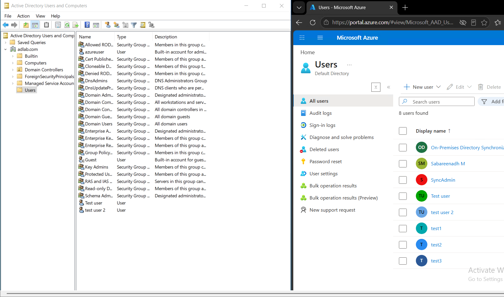
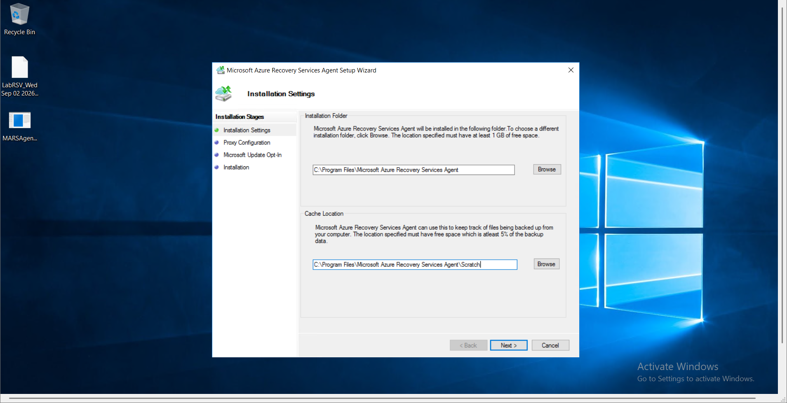
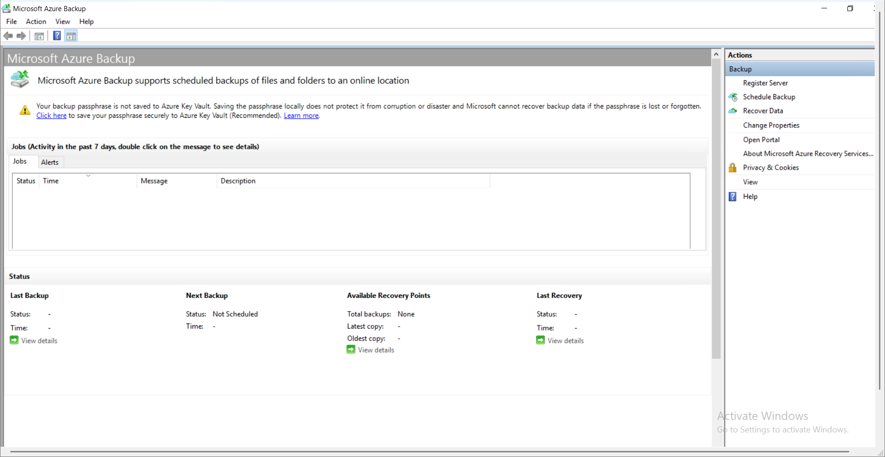
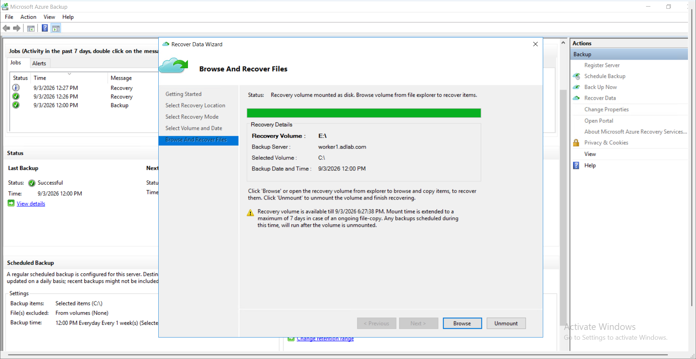

# Project 4: Hybrid Cloud Integration - Identity & Data Protection

## 📖 Project Overview
Modern enterprise architectures rarely exist purely on-premises or purely in the cloud; they are hybrid. In this project, I integrated local Active Directory resources with Microsoft Azure. I configured **Microsoft Entra ID Connect** to synchronize local user identities to the cloud, and deployed the **Microsoft Azure Recovery Services (MARS) Agent** to back up local workstation data to an Azure cloud vault.

## 🛠️ Skills & Technologies Demonstrated
* Hybrid Identity Management
* Microsoft Entra ID (formerly Azure AD) Connect
* Azure Recovery Services Vault (RSV)
* MARS Agent Deployment & Configuration
* Disaster Recovery & File Restoration

## 🚀 Step-by-Step Implementation

### Phase 1: Hybrid Identity Synchronization

#### Step 1: Entra ID Connect Verification
After installing and configuring Microsoft Entra ID Connect on the domain, I verified the synchronization. In the side-by-side view below, local Active Directory users (left) are successfully synced to the Microsoft Entra ID cloud tenant (right), allowing users to use a single identity for both local and cloud applications.

### Phase 2: Hybrid Data Protection (Azure Backup)

#### Step 2: MARS Agent Installation
To protect local workload data, I downloaded and installed the Microsoft Azure Recovery Services (MARS) Agent onto the domain-joined `Worker1` machine.

#### Step 3: Vault Registration
Once installed, I registered the local server to my Azure Recovery Services Vault. This establishes a secure, encrypted connection to send local backups to Microsoft's cloud storage.

#### Step 4: Backup Execution and File Recovery
After running an initial backup schedule, I performed a disaster recovery test. Using the "Recover Data Wizard," I successfully pulled down a cloud backup point and mounted it as a local recovery volume (Drive E:) to selectively restore files directly from Azure.

## 💡 Key Takeaways
This project bridges the gap between traditional infrastructure and modern cloud services. By implementing hybrid identity synchronization and hybrid cloud backups, the environment now supports seamless cloud authentication and off-site disaster recovery without abandoning the existing on-premises server architecture.
