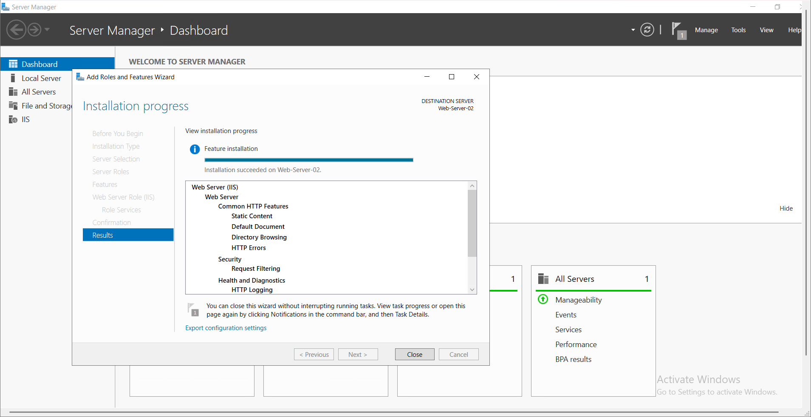
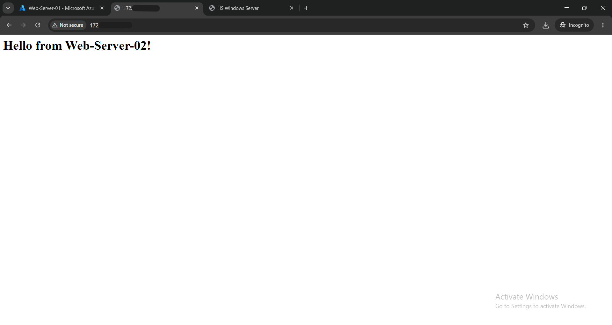
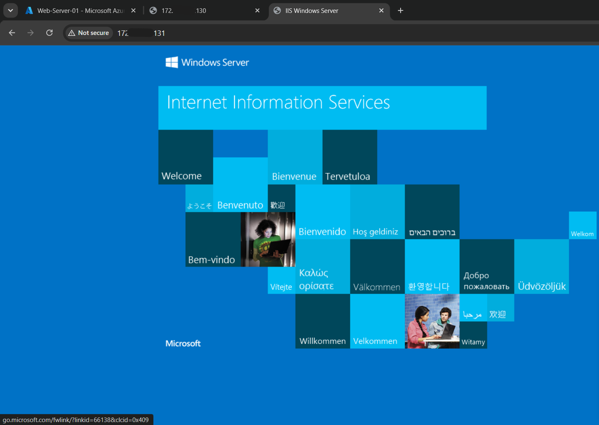
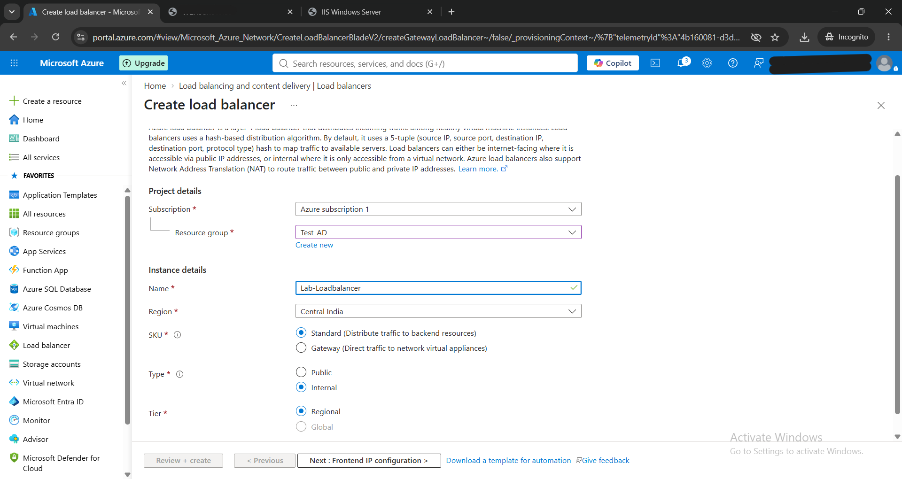
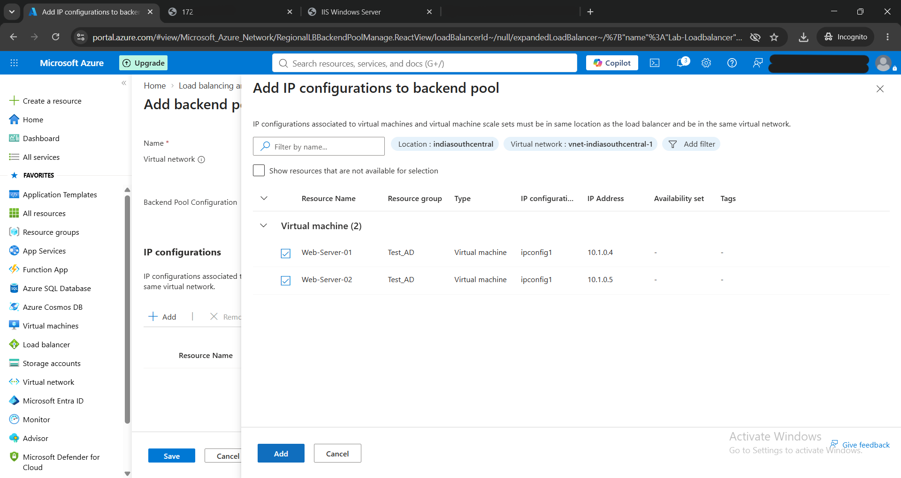
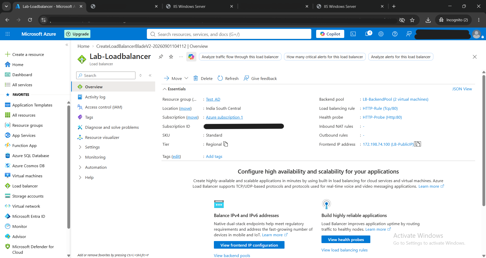
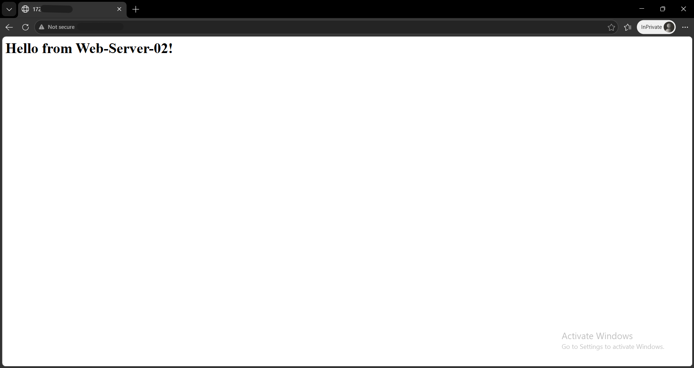

# Project 5: High Availability with Azure Web Server Load Balancing

## 📖 Project Overview
For enterprise applications, relying on a single web server introduces a single point of failure and limits scalability. To achieve High Availability (HA), I provisioned a secondary IIS Web Server and deployed an Azure Load Balancer. This architecture distributes incoming network traffic intelligently across multiple virtual machines, ensuring application resilience and consistent performance.

## 🛠️ Skills & Technologies Demonstrated
* High Availability (HA) Architecture
* Azure Load Balancer Deployment
* Backend Pool & Health Probe Configuration
* Network Address Translation (NAT) & Traffic Routing
* Multi-Server IIS Administration

## 🚀 Step-by-Step Implementation

### Step 1: Secondary Server Provisioning
To create a redundant backend pool, I deployed a second virtual machine (`Web-Server-02`) and installed the IIS Web Server role via Server Manager. 

### Step 2: Content Differentiation for Testing
To visually verify that traffic was being routed between different machines, I hosted the default IIS welcome page on server 1, and customized the `index.html` file on server 2 to read *"Hello from Web-Server-02!"*. I successfully verified both pages locally via their private IP addresses.

### Step 3: Load Balancer Creation
I provisioned a standard Azure Load Balancer designed to manage internal regional traffic within my virtual network.

### Step 4: Backend Pool Configuration
With the load balancer provisioned, I configured the Backend Pool by attaching the network interfaces of both `Web-Server-01` and `Web-Server-02`. This dictates exactly where the load balancer is allowed to send incoming traffic.

### Step 5: Traffic Routing & Verification
Finally, I configured Health Probes to monitor server uptime and set up Load Balancing Rules for Port 80 (HTTP). By navigating to the Load Balancer's Frontend IP address in a private browser, the request was successfully routed to the active backend server, proving the traffic distribution logic is fully operational.

## 💡 Key Takeaways
Implementing an Azure Load Balancer proves the ability to architect resilient cloud environments. By distributing traffic across a backend pool, this setup eliminates single points of failure, allows for seamless server patching without downtime, and ensures the application can scale horizontally to meet user demand.
